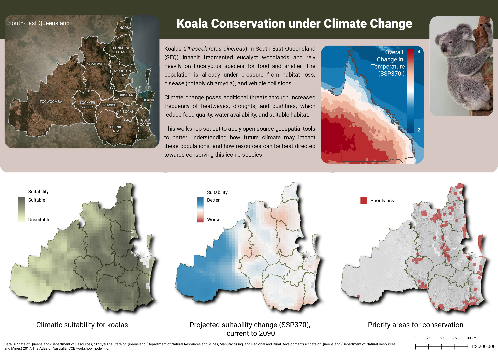

# QGIS Courses by our Community
### Listed below are courses created by our community members for public use:
## QGIS - Making beautiful maps
**Course link:** [QGIS - Making beautiful maps](https://emhain8.github.io./QGIS-Cartography-ICCB/)  
This course was create for environmental scientists attending the ICCB 2025 Conference in Brisbane. It uses data created in the adjacent sessions of the workshop (of which the outputs are provided for you in the data folder) to create the map below. The intention is to introduce the power of styling and some hints in creating a product. The whole course can be found at the [ICCB - Open Geospatial Tools](https://geospatial-community.github.io/ICCB_geospatial_tools_conservation/) run by Geospatial Share Community of Practice.   

End product from the course - test your map skills - what is missing here?  
